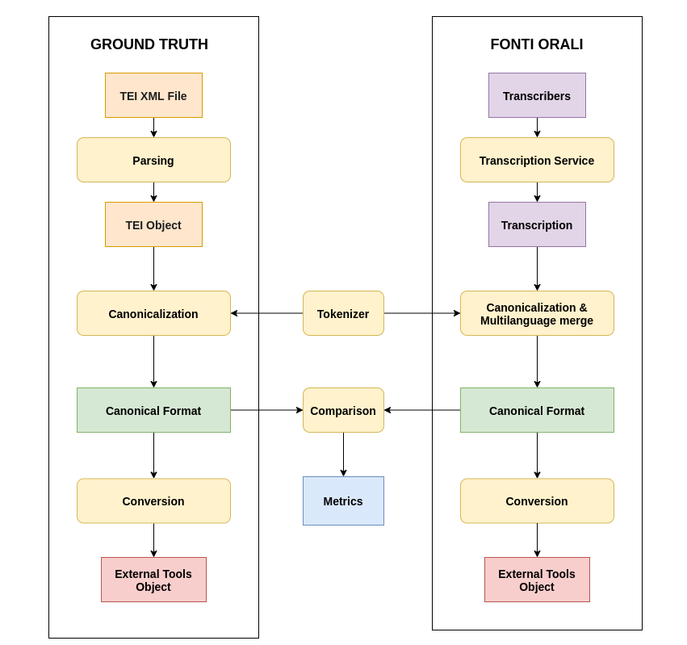

# Speech-to-Text experiments
This repository contains experiments with different transcription services for Fonti4.0 project.  
The required Python version is `3.8.x`  
For packages and virtual environment management the chosen tool is `pipenv`.


## Infrastructure



## Local environment
### Setup
1. Download and install [PyCharm IDE](https://www.jetbrains.com/pycharm/download/#section=linux).
2. Install `pipenv`. A guide is available [here](https://pipenv.pypa.io/en/latest/install/#installing-pipenv).
3. Create a new PyCharm project from this GIT repository.
4. If necessary run scripts in `/scripts` to install Google SDk and/or AWS CLI.
5. Execute `PIPENV_VENV_IN_PROJECT=1 pipenv sync --dev` to initialize the virtual env and download the required 
   packages.
6. Reboot PyCharm to activate the new virtual environment.
7. Create your `/config/config.ini` file from `/config/config.ini.sample`.
8. Open a terminal inside PyCharm and run: `python -m ipykernel install --user --name=fonti4.0` to install a custom 
   kernel for Jupyter 
9. Run the notebook with `jupyter notebook --MultiKernelManager.default_kernel_name=fonti4.0 
   ./notebooks/<ipynb_file>` (substitute <ipynb_file> with the notebook that you want to run)

### Install new Python packages
If you need a new package while developing, always use `pipenv`:
```shell script
# Use [package_name]==[version] to install a specific package's version 
# If you don't specify any version Pipfile package requirement will be inserted with '*' (allow any version)
# Use -d option to install the package as dev-requirement
pipenv install <package>
```
This will update the `Pipfile` and `Pipfile.lock` files and share the requirements with the other developers and 
environments.

## Canonical format

In order to use evaluation algorithms and thus obtain comparison metrics for the different transcription services, a 
translation in a canonical format of the latter's output is carried out, as you can guess from the diagram above.
### Protocol Buffers
The structure for the canonical model was defined using Google's 
[Protocol Buffers](https://developers.google.com/protocol-buffers/docs/pythontutorial) mechanism.
All `.proto` files must be placed inside the folder `/protocol-buffers` and their respective compiled modules reside 
in the folder `/modules/compiled`.

Follow these steps if there is a need to change the canonical transcription model:
1. Install `Protobuf Compiler` by running `/scripts/protobuf_install.sh`.
2. Make any necessary changes to the target `.proto` file.
3. Compile `.proto` files in `/protocol-buffers` folder by running `/scripts/protobuf_compile.sh`.


## Speech-to-Text services
As of now two are the services being tested: Google Speech-to-Text and AWS Transcribe.

### Google Speech-to-Text
In order to perform the tests you need to have an active Google Cloud Platform (GCP) account with 
Cloud Speech-to-Text API enabled. 
For files larger than 10 MB it is necessary to have a bucket in Google Cloud Storage in which an automatic upload of 
these files will be carried out.
#### Authentication
There are two ways you can authenticate as a service account to GCP (more details 
[here](https://cloud.google.com/docs/authentication/production)):
1. Run `/scripts/gcloud_sdk_install.sh` and follow the instructions (this will install 
   [Google Cloud SDK](https://cloud.google.com/sdk/docs/quickstart) on your system).
2. Set the `SERVICE_ACCOUNT_JSON_FILE_PATH` configuration to point to a JSON file containing the service account 
   credentials (see next section for more details on service configuration options).
>**Warning**: if you choose the second authentication method, make sure that the service account has the necessary 
> permissions to access the Speech-to-Text and Cloud Storage services.
#### Configuration
Configuration parameters for Google Speech-to-Text can be found in the `[Google_STT]` section of the main configuration 
file `/config/config.ini`. All the details for the configurations regarding the transcription request are available 
[here](https://cloud.google.com/speech-to-text/docs/reference/rest/v1/RecognitionConfig), while other custom 
configurations have been introduced:
- `INPUT_BUCKET_NAME` - Name of the bucket to which the local file will be uploaded if its size is greater than 10 MB.
  <u>e.g.</u> `fonti40_cini`.
- `INPUT_BLOB_PREFIX` - Prefix of the bucket's blob where the local file will be uploaded. It can be used to indicate a
  path to a folder in the bucket. <u>e.g.</u> `speeches/`.
  
The local file will then be uploaded to the bucket at the given location while keeping its name, and the URI will be:
`gs://[INPUT_BUCKET_NAME]/[INPUT_BLOB_PREFIX][FILE_NAME]`. <u>e.g.</u> `gs://fonti40_cini/speeches/local_speech.wav`.

- `LONG_RECOGNIZE_TIMEOUT` - Timeout in seconds for a long transcription operation: after this time the request will be 
  aborted. Default value is `3600`.
- `PROJECT_ID` - The project to which the GCS bucket is related to. Required.
- `SERVICE_ACCOUNT_JSON_FILE_PATH` - Path to a JSON file containing a service account credentials. If set, it will be 
  used by libraries' clients to authenticate to GCP.
- `TRANSCRIPTION_OUTPUT_PATH` - Local path to which transcripts file will be saved.
- `CANONICAL_TRANSCRIPTION_OUTPUT_PATH` - Local path to which canonical transcripts file will be saved.

### AWS Transcribe
In order to perform the tests you need to have an active Amazon Web Services (AWS) account with 
a IAM user that has permissions to us AWS Transcribe and S3 services.
AWS Transcribe requires the file to be in a storage bucket to transcribe it, so for local file transcription requests an 
automatic upload of these files will be carried out.
>**Warning**: default IAM permission `AmazonTranscribeFullAccess` gives full access to transcribe service but read 
> permission to all buckets that contain the string "transcribe" in the name. If the bucket that is set as output 
> doesn't contain this string, be sure to manually assign permissions to that bucket for the user.
#### Authentication
There are two ways you can authenticate as a user to AWS (more details 
[here](https://docs.aws.amazon.com/cli/latest/userguide/cli-configure-files.html)):
1. Run `/scripts/aws_cli_install.sh` and follow the instructions (this will install 
   [AWS CLI](https://aws.amazon.com/cli/) on your system).
2. Set `AWS_ACCESS_KEY_ID` and `AWS_SECRET_ACCESS_KEY` configurations to provide the user's credentials 
   (see next section for more details on service configuration options).
#### Configuration
Configuration parameters for AWS Transcribe can be found in the `[AWS_Transcribe]` section of the main 
configuration file `/config/config.ini`. All the details for the configurations regarding the transcription request 
are available [here](https://docs.aws.amazon.com/transcribe/latest/dg/API_StartTranscriptionJob.html), while other 
custom configurations have been introduced:
- `INPUT_BUCKET_NAME` - Name of the bucket to which the local file will be uploaded. <u>e.g.</u> `fonti4.0`.
- `INPUT_KEY_PREFIX` - Prefix of the bucket's key where the local file will be uploaded. It can be used to indicate a
  path to a folder in the bucket. <u>e.g.</u> `speeches/`.
  
The local file will then be uploaded to the bucket at the given location while keeping its name, and the URI will be:
`s3://[INPUT_BUCKET_NAME]/[INPUT_KEY_PREFIX][FILE_NAME]`. <u>e.g.</u> `s3://fonti4.0/speeches/local_speech.wav`.

- `TRANSCRIPTION_JOB_NAME_PREFIX` - Prefix for the AWS transcription job's name. The name of the transcription job is 
  obtained by appending this prefix to the file name: `[TRANSCRIPTION_JOB_NAME_PREFIX]_[FILE_NAME]`.
- `AWS_ACCESS_KEY_ID` - AWS Access Key ID of the user to authenticate.
- `AWS_SECRET_ACCESS_KEY` - AWS Secret Access Key of the user to authenticate.
- `TRANSCRIPTION_OUTPUT_PATH` - Local path to which transcripts file will be saved.
- `CANONICAL_TRANSCRIPTION_OUTPUT_PATH` - Local path to which canonical transcripts file will be saved.
